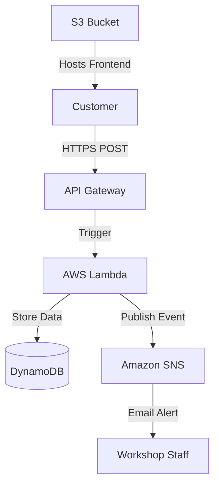

# Serverless Car Repair Management System


A fully **serverless**, cloud-native application designed to streamline car repair requests.

The system allows customers to submit repair tickets that are:
- Automatically stored in a database
- Instantly triggering email notifications to workshop staff

Built entirely using **AWS serverless services**, Infrastructure as Code, and automated CI/CD.

---

# Architecture



---

# Key Components

### Frontend
- Static HTML/CSS/JS
- Hosted on Amazon S3
- Uses Fetch API to communicate with backend

### API
- Amazon API Gateway (HTTP API)
- Secure HTTPS endpoint

### Compute
- AWS Lambda (Python 3.9)
- Handles:
  - Input validation
  - Ticket creation
  - DynamoDB interaction
  - SNS notification

### Database
- Amazon DynamoDB
- Stores:
  - Ticket ID
  - Car Model
  - Description
  - Status

### Notifications
- Amazon SNS
- Sends real-time email alerts to workshop staff

---

# Key Features

- 100% Serverless
- Infrastructure as Code (CloudFormation)
- CI/CD pipeline
- Automatic frontend deployment
- Lambda update only if code changed (MD5 hash check)

---

# Tech Stack

| Category        | Technology |
|---------------|------------|
| Cloud Provider | AWS |
| IaC | AWS CloudFormation (YAML) |
| Compute | AWS Lambda (Python 3.9) |
| Database | Amazon DynamoDB |
| API | Amazon API Gateway (HTTP) |
| Frontend | HTML5, CSS3, JavaScript |
| CI/CD | GitHub Actions |

---

# Project Structure

```
SERVERLESS-CAR-REPAIR-MANAGEMENT-SYSTEM/
│
├── .github/workflows/
│   └── deploy.yml          # CI/CD Pipeline
│
├── frontend/
│   └── index.html          # Frontend
│
├── infrastructure/
│   └── template.yaml       # CloudFormation template
│
├── src/
│   └── lambda_function.py  # Backend logic
│
└── README.md
```

---

# Deployment

---

## Option 1: Automatic Deployment (Recommended)

The project is configured with **GitHub Actions CI/CD**.

### How it works:
1. Push changes to the `main` branch.
2. The pipeline will:
   - Package Lambda function
   - Calculate MD5 hash
   - Update Lambda only if code changed
   - Update CloudFormation stack
   - Sync frontend to S3

Fully automated deployment

---
