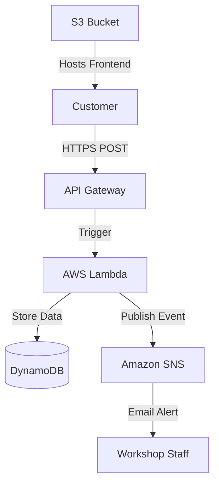

# Serverless Car Repair Management System


A fully **serverless**, cloud-native application designed to streamline car repair requests.

The system allows customers to submit repair tickets that are:
- Automatically stored in a database
- Instantly triggering email notifications to workshop staff

Built entirely using **AWS serverless services**, Infrastructure as Code, and automated CI/CD.

---

# Architecture



---

# Key Components

### Frontend
- Static HTML/CSS/JS
- Hosted on Amazon S3
- Uses Fetch API to communicate with backend

### API
- Amazon API Gateway (HTTP API)
- Secure HTTPS endpoint

### Compute
- AWS Lambda (Python 3.12)
- Lambda Layer with dependencies (Pydantic, AWS Lambda Powertools)
- Handles:
  - Input validation with Pydantic
  - Ticket creation
  - DynamoDB interaction
  - SNS notification
  - Structured logging

### Database
- Amazon DynamoDB
- Stores:
  - Ticket ID
  - Car Model
  - Description
  - Status

### Notifications
- Amazon SNS
- Sends real-time email alerts to workshop staff

---

# Key Features

- 100% Serverless
- Infrastructure as Code (AWS CDK)
- CI/CD pipeline
- Automatic frontend deployment
- Lambda layers for dependencies (Pydantic, AWS Lambda Powertools)
- Input validation with Pydantic
- Structured logging with AWS Lambda Powertools

---

# Tech Stack

| Category        | Technology |
|---------------|------------|
| Cloud Provider | AWS |
| IaC | AWS CDK (Python) |
| Compute | AWS Lambda (Python 3.12) |
| Database | Amazon DynamoDB |
| API | Amazon API Gateway (HTTP API) |
| Frontend | HTML5, CSS3, JavaScript |
| CI/CD | GitHub Actions |
| Libraries | AWS Lambda Powertools, Pydantic |

---

# Project Structure

```
SERVERLESS-CAR-REPAIR-MANAGEMENT-SYSTEM/
│
├── .github/workflows/
│   └── deploy.yml          # CI/CD Pipeline (CloudFormation - legacy)
│
├── cdk-infra/              # AWS CDK Infrastructure
│   ├── app.py              # CDK App entry point
│   ├── cdk.json            # CDK configuration
│   ├── requirements.txt    # CDK dependencies
│   └── cdk_infra/
│       └── cdk_infra_stack.py  # Main CDK stack definition
│
├── cdk-frontend/           # Frontend for CDK deployment
│   └── index.html
│
├── frontend/               # Frontend (legacy)
│   └── index.html
│
├── infrastructure/         # CloudFormation templates (legacy)
│   └── template.yaml
│
├── lambda_layer/           # Lambda Layer with dependencies
│   └── python/
│       └── [dependencies]
│
├── src/
│   ├── lambda_cdk.py      # Lambda handler for CDK
│   ├── lambda_function.py # Lambda handler (legacy)
│   └── requirements.txt    # Lambda dependencies
│
└── README.md
```

---

# Deployment

---

## Option 1: Automatic Deployment (Recommended)

The project is configured with **GitHub Actions CI/CD**.

### How it works:
1. Push changes to the `main` branch.
2. The pipeline will:
   - Package Lambda function
   - Calculate MD5 hash
   - Update Lambda only if code changed
   - Update CloudFormation stack
   - Sync frontend to S3

Fully automated deployment

---
