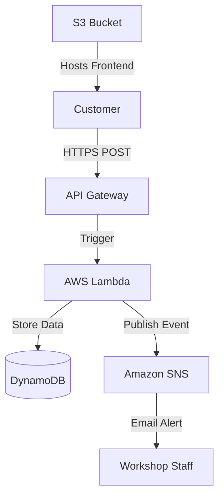

# Serverless Car Repair Management System


A fully **serverless**, cloud-native application designed to streamline car repair requests.

The system allows customers to submit repair tickets that are:
- Automatically stored in a database
- Instantly triggering email notifications to workshop staff

Built entirely using **AWS serverless services**, Infrastructure as Code, and automated CI/CD.

> **Note:** This project contains **two separate implementations**:
> - **Production version**: CloudFormation + GitHub Actions (currently deployed and working)
> - **Experimental version**: AWS CDK (created for learning purposes)

---

# Architecture



---

# CloudFormation + GitHub Actions

This is the **current production deployment** that is actively running.

## Components

### Frontend
- Static HTML/CSS/JS
- Hosted on Amazon S3
- Uses Fetch API to communicate with backend
- Located in `frontend/` directory

### API
- Amazon API Gateway (HTTP API)
- Secure HTTPS endpoint

### Compute
- AWS Lambda (Python 3.9)
- Handler: `lambda_function.py`
- Handles:
  - Input validation
  - Ticket creation
  - DynamoDB interaction
  - SNS notification

### Database
- Amazon DynamoDB
- Stores:
  - Ticket ID
  - Car Model
  - Description
  - Status

### Notifications
- Amazon SNS
- Sends real-time email alerts to workshop staff

## Tech Stack

| Category       | Technology                    |
| -------------- | ----------------------------- |
| Cloud Provider | AWS                           |
| IaC            | AWS CloudFormation (YAML)     |
| Compute        | AWS Lambda (Python 3.9)      |
| Database       | Amazon DynamoDB               |
| API            | Amazon API Gateway (HTTP API) |
| Frontend       | HTML5, CSS3, JavaScript       |
| CI/CD          | GitHub Actions                |

## Project Structure

```
├── .github/workflows/
│   └── deploy.yml          # CI/CD Pipeline
│
├── frontend/
│   └── index.html          # Frontend application
│
├── infrastructure/
│   └── template.yaml       # CloudFormation template
│
└── src/
    └── lambda_function.py  # Lambda handler
```

## Deployment

### Automatic Deployment (GitHub Actions)

The project is configured with **GitHub Actions CI/CD** for automated deployment.

**How it works:**
1. Push changes to the `main` branch
2. The pipeline automatically:
   - Packages Lambda function
   - Calculates MD5 hash
   - Updates Lambda only if code changed
   - Updates CloudFormation stack
   - Syncs frontend to S3

**Configuration:**
- Pipeline definition: `.github/workflows/deploy.yml`
- Infrastructure: `infrastructure/template.yaml`
- Frontend: `frontend/` directory
- Lambda code: `src/lambda_function.py`

**Required GitHub Secrets:**
- `AWS_ACCESS_KEY_ID`
- `AWS_SECRET_ACCESS_KEY`
- `AWS_REGION`
- `ARTIFACTS_BUCKET_NAME`
- `FRONTEND_BUCKET_NAME`

---

# AWS CDK (Experimental/Learning)

This is an **experimental version** created for learning AWS CDK. It is **not currently deployed**.

## Components

### Frontend
- Static HTML/CSS/JS
- Hosted on Amazon S3
- Uses Fetch API to communicate with backend
- Located in `cdk-frontend/` directory
- Automatically deployed via CDK S3 BucketDeployment

### API
- Amazon API Gateway (HTTP API)
- Secure HTTPS endpoint
- CORS configured for cross-origin requests

### Compute
- AWS Lambda (Python 3.12)
- Handler: `lambda_cdk.py`
- Lambda Layer with dependencies:
  - Pydantic (data validation)
  - AWS Lambda Powertools (structured logging, utilities)
- Handles:
  - Input validation with Pydantic
  - Ticket creation
  - DynamoDB interaction
  - SNS notification
  - Structured logging with Powertools

### Database
- Amazon DynamoDB
- Stores:
  - Ticket ID
  - Car Model
  - Description
  - Email

### Notifications
- Amazon SNS
- Sends real-time email alerts to workshop staff

## Tech Stack

| Category       | Technology                                 |
| -------------- | ------------------------------------------- |
| Cloud Provider | AWS                                         |
| IaC            | AWS CDK (Python)                            |
| Compute        | AWS Lambda (Python 3.12)                    |
| Database       | Amazon DynamoDB                             |
| API            | Amazon API Gateway (HTTP API)               |
| Frontend       | HTML5, CSS3, JavaScript                     |
| Libraries      | AWS Lambda Powertools, Pydantic              |
| Deployment     | Manual (CDK CLI)                            |

## Project Structure

```
├── cdk-infra/              # AWS CDK Infrastructure
│   ├── app.py              # CDK App entry point
│   ├── cdk.json            # CDK configuration
│   ├── requirements.txt    # CDK dependencies
│   └── cdk_infra/
│       └── cdk_infra_stack.py  # Main CDK stack definition
│
├── cdk-frontend/           # Frontend for CDK deployment
│   └── index.html
│
├── lambda_layer/           # Lambda Layer with dependencies
│   └── python/
│       └── [Pydantic, Powertools]
│
└── src/
    └── lambda_cdk.py      # Lambda handler for CDK
```

## Deployment

### Prerequisites

- AWS CLI configured with appropriate credentials
- Python 3.12+
- Node.js (for CDK CLI)
- AWS CDK CLI installed: `npm install -g aws-cdk`

### Deploy with CDK

1. **Navigate to the CDK directory:**
   ```bash
   cd cdk-infra
   ```

2. **Install CDK dependencies:**
   ```bash
   python -m venv .venv
   .venv\Scripts\activate  # Windows
   # source .venv/bin/activate  # Linux/Mac
   pip install -r requirements.txt
   ```

3. **Bootstrap CDK (first time only):**
   ```bash
   cdk bootstrap
   ```

4. **Deploy the stack:**
   ```bash
   cdk deploy
   ```

5. **View outputs:**
   After deployment, CDK will output:
   - Frontend URL (S3 website endpoint)
   - API Gateway endpoint URL

### CDK Commands

- `cdk synth` - Synthesize CloudFormation template
- `cdk deploy` - Deploy stack to AWS
- `cdk diff` - Compare deployed stack with current state
- `cdk destroy` - Remove all resources
- `cdk ls` - List all stacks

---

# Key Differences

| Feature                    | CloudFormation + GitHub Actions | AWS CDK                    |
| -------------------------- | ------------------------------- | -------------------------- |
| **Status**                 | Production (currently running)  | Experimental (learning)   |
| **Python Version**         | 3.9                             | 3.12                       |
| **Lambda Libraries**       | Standard boto3                  | Powertools + Pydantic      |
| **Deployment**             | Automated (GitHub Actions)      | Manual (CDK CLI)           |
| **Frontend Deployment**    | Manual S3 sync in pipeline      | Automatic (CDK)            |
| **Infrastructure Code**    | YAML templates                  | Python code                |
| **Lambda Layers**          | No                              | Yes                        |
| **Structured Logging**     | No                              | Yes (Powertools)          |
| **Input Validation**       | Basic                           | Pydantic models            |
