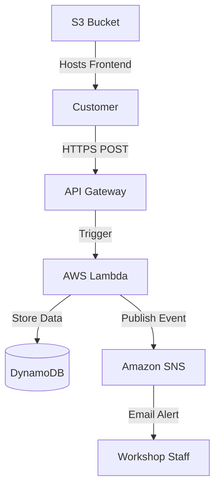

# Serverless Car Repair Management System


A fully **serverless**, cloud-native application designed to streamline car repair requests.

The system allows customers to submit repair tickets that are:
- Automatically stored in a database
- Instantly triggering email notifications to workshop staff

Built entirely using **AWS serverless services**, Infrastructure as Code, and automated CI/CD.

> **Note:** This project contains **two separate implementations**:
> - **Production version**: CloudFormation + GitHub Actions (currently deployed and working)
> - **Experimental version**: AWS CDK (created for learning purposes)

---

# Architecture


```mermaid
graph TD;
    User[Customer] -->|HTTPS POST| API[API Gateway];
    API -->|Trigger| Lambda[AWS Lambda];
    Lambda -->|Store Data| DB[(DynamoDB)];
    Lambda -->|Publish Event| SNS[Amazon SNS];
    SNS -->|Email Alert| Admin[Workshop Staff];
    S3[S3 Bucket] -->|Hosts Frontend| User;
```

---

# CloudFormation + GitHub Actions

This is the **current production deployment** that is actively running.

## Components

### Frontend
- Static HTML/CSS/JS
- Hosted on Amazon S3
- Uses Fetch API to communicate with backend
- Located in `frontend/` directory

### API
- Amazon API Gateway (HTTP API)
- Secure HTTPS endpoint

### Compute
- AWS Lambda (Python 3.9)
- Handler: `lambda_function.py`
- Handles:
  - Input validation
  - Ticket creation
  - DynamoDB interaction
  - SNS notification

### Database
- Amazon DynamoDB
- Stores:
  - Ticket ID
  - Car Model
  - Description
  - Status

### Notifications
- Amazon SNS
- Sends real-time email alerts to workshop staff

## Tech Stack

| Category       | Technology                    |
| -------------- | ----------------------------- |
| Cloud Provider | AWS                           |
| IaC            | AWS CloudFormation (YAML)     |
| Compute        | AWS Lambda (Python 3.9)      |
| Database       | Amazon DynamoDB               |
| API            | Amazon API Gateway (HTTP API) |
| Frontend       | HTML5, CSS3, JavaScript       |
| CI/CD          | GitHub Actions                |

## Project Structure

```
├── .github/workflows/
│   └── deploy.yml          # CI/CD Pipeline
│
├── frontend/
│   └── index.html          # Frontend application
│
├── infrastructure/
│   └── template.yaml       # CloudFormation template
│
└── src/
    └── lambda_function.py  # Lambda handler
```

## Deployment

### Automatic Deployment (GitHub Actions)

The project is configured with **GitHub Actions CI/CD** for automated deployment.

**How it works:**
1. Push changes to the `main` branch
2. The pipeline automatically:
   - Packages Lambda function
   - Calculates MD5 hash
   - Updates Lambda only if code changed
   - Updates CloudFormation stack
   - Syncs frontend to S3

**Configuration:**
- Pipeline definition: `.github/workflows/deploy.yml`
- Infrastructure: `infrastructure/template.yaml`
- Frontend: `frontend/` directory
- Lambda code: `src/lambda_function.py`

**Required GitHub Secrets:**
- `AWS_ACCESS_KEY_ID`
- `AWS_SECRET_ACCESS_KEY`
- `AWS_REGION`
- `ARTIFACTS_BUCKET_NAME`
- `FRONTEND_BUCKET_NAME`

---

